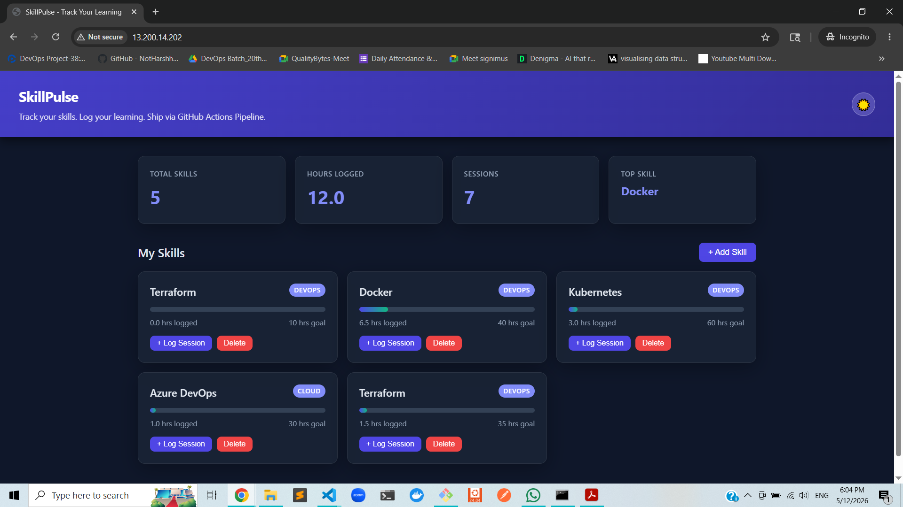

# 🚀 SkillPulse – CI/CD Deployment with GitHub Actions

---

## 📌 Project Overview

SkillPulse is a **3-tier DevOps project** that demonstrates a complete **CI/CD pipeline** using modern DevOps tools.

The application is automatically:
- Built
- Containerized
- Pushed to Docker Hub
- Deployed to AWS EC2

This project simulates a **real-world production deployment workflow** using GitHub Actions.

---

## 🏗️ Architecture Diagram


> ⚠️ If the image does not appear on GitHub, ensure the file is placed at:
`/assets/architecture.png`

---

## 🧱 System Architecture

- **Frontend:** Nginx (Docker Container)
- **Backend:** Node.js / Go (API Service Container)
- **Database:** MySQL (Docker Container)
- **CI/CD:** GitHub Actions
- **Server:** AWS EC2 (Ubuntu)
- **Containerization:** Docker + Docker Compose

---

## ⚙️ Tech Stack

- Git & GitHub
- GitHub Actions (CI/CD)
- Docker & Docker Compose
- AWS EC2 (Ubuntu)
- Nginx
- MySQL

---

## 📂 Project Structure
github-actions-skillpulse-deployment/
│
├── .github/
│ └── workflows/
│ ├── ci.yml # CI Pipeline
│ └── cd.yml # CD Pipeline
│
├── docker-compose.yml
├── .env # Environment variables (EC2 server)
└── README.md


---

## 🔄 CI/CD Pipeline Flow

### 1️⃣ CI Pipeline (Continuous Integration)

- Code pushed to GitHub
- GitHub Actions triggers `ci.yml`
- Docker images are built
- Images pushed to Docker Hub

---

### 2️⃣ CD Pipeline (Continuous Deployment)

Triggered after successful CI:

```bash
docker compose pull
docker compose up -d
docker image prune -f

SSH into EC2
Pull latest images
Deploy containers
Application goes live 🚀

🛠️ EC2 Server Setup
Launch EC2 Instance
OS: Ubuntu
Instance Type: t2.medium / t2.large
Security Groups:
SSH (22)
HTTP (80)
MySQL (3306 - optional)

Install Dependencies
sudo apt-get update -y
sudo apt-get install -y docker.io
sudo apt-get install -y docker-compose-v2

Enable Docker Access
sudo usermod -aG docker ubuntu
newgrp docker
docker ps
🔐 GitHub Secrets Configuration

Go to:

👉 GitHub Repository → Settings → Secrets and Variables → Actions

Add:

Secret Name	Description
DOCKER_USERNAME	Docker Hub username
DOCKER_PASSWORD	Docker Hub token/password
EC2_HOST	EC2 Public IP
EC2_USER	ubuntu
EC2_SSH_KEY	PEM private key
📦 Docker Setup

The project uses docker-compose.yml to run:

Frontend container (Nginx)
Backend API container
MySQL database container
🌐 Environment Variables (.env on EC2)

Create .env file on EC2:

DB_HOST=db
DB_USER=root
DB_PASSWORD=yourpassword
DB_NAME=skillpulse
🚀 Deployment Workflow
Developer Push Code
        ↓
GitHub Repository
        ↓
CI Pipeline (Build & Push Docker Image)
        ↓
Docker Hub (Image Registry)
        ↓
CD Pipeline Trigger
        ↓
SSH into EC2 Server
        ↓
docker compose pull & up -d
        ↓
🎉 Application Live
📸 Final Result

After deployment:

🌐 Frontend → http://EC2-PUBLIC-IP
🔗 Backend API → http://EC2-PUBLIC-IP:8080
🗄️ MySQL → Running inside container
🎯 Key Learnings
CI/CD automation with GitHub Actions
Docker container orchestration
AWS EC2 deployment
Real-world DevOps pipeline design
Secure secrets management
🔥 Future Improvements
HTTPS setup using Nginx + Let’s Encrypt
Kubernetes deployment (EKS)
Monitoring with Prometheus & Grafana
Auto rollback strategy in CD pipeline
👨‍💻 Author

Anil Choudhary
DevOps Engineer | AWS | Docker | Kubernetes | CI/CD


---

